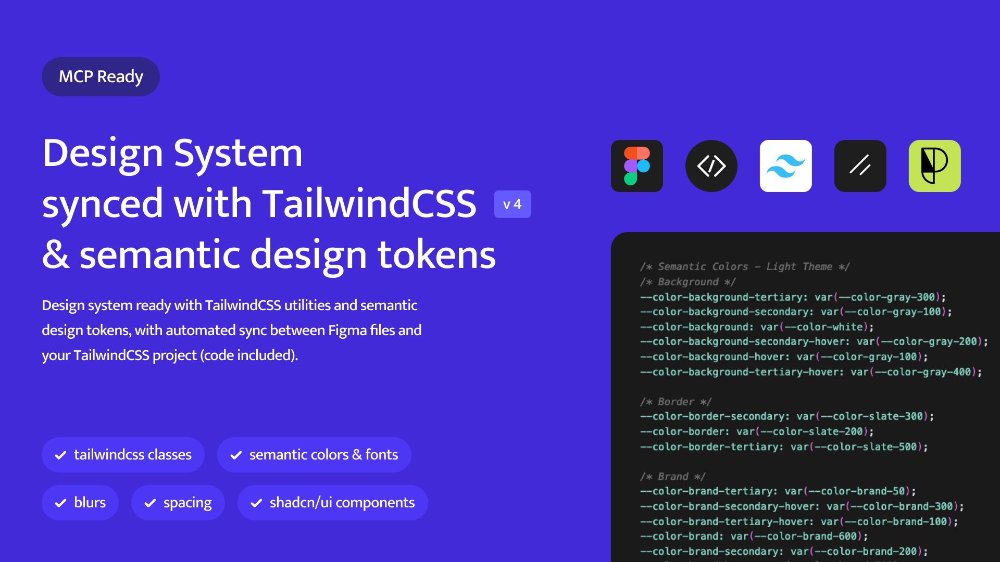

# Figma-Tailwind Design System CookieCutter
> **A Tailwind project that actually aligns to your design system**
>


Whether you're vibe-coding, prototyping, building production apps or setting up design systems - this cookiecutter creates true alignment between your Figma designs and codebase without comprimise for development or design standard.
<br><br>
## 🎪 Who This Is For
- **Designers & Product People** Create prototypes that actually look like your designs
- **Development Teams** Expedite the set up to align to your design system -> build faster
- **Design and Frontend Ops** - Single source of truth, automated consistency across design and code
<br><br>
## 🚀 5-Minute Setup
1. **Get the Figma Community File** - [📁 Download Figma Community File](https://www.figma.com/community/file/1526688065982358612)
2. **Customise Your Tokens** - Modify colors and fonts in Figma
3. **Sync to Code** - Export your tokens and run the sync scripts to generate Tailwind variables and classes
<br><br>
## 🙌 Clone & Install
```bash
git clone https://github.com/alfrankl1/figma-tailwind-cookiecutter.git
cd figma-tailwind-cookiecutter
npm install
```
<br><br>
## ✨ Key Features

- 🎨 **True Figma-Code Alignment** - Design tokens sync automatically
- 🌗 **Smart Themes** - Light/dark modes with semantic variables
- ⚡ **Tailwind 4.1** - Latest version with CSS variables
- 🧩 **shadcn Foundation** - Pre-built components, design-aligned
- 🎯 **MCP-Ready** - Optimized for AI vibe-coding workflows
- 📐 **Pixel-Perfect Typography** - Font styles match Figma exactly

<br><br>
## 🎯 Design Philosophy

### Semantic Colors
```css
/* Instead of hard-coded */
bg-blue-500

/* Use semantic tokens */
bg-brand text-brand-secondary border-brand-tertiary
```

### Typography Alignment
```css
.font-button      /* Matches Figma button styles */
.font-title       /* Matches Figma headings */
.font-body-large  /* Matches Figma body text */
```

## 🛠 Tech Stack

- **Next.js 15.3.5** + **TypeScript**
- **Tailwind CSS 4.1** with native CSS variables
- **shadcn/ui** components (customised)
- **Phosphor Icons** (Figma-aligned)

## 🤝 Contributing

Help build the ultimate Figma-code bridge:
- Add component integrations
- Improve sync scripts
- Share your setups

MIT License
